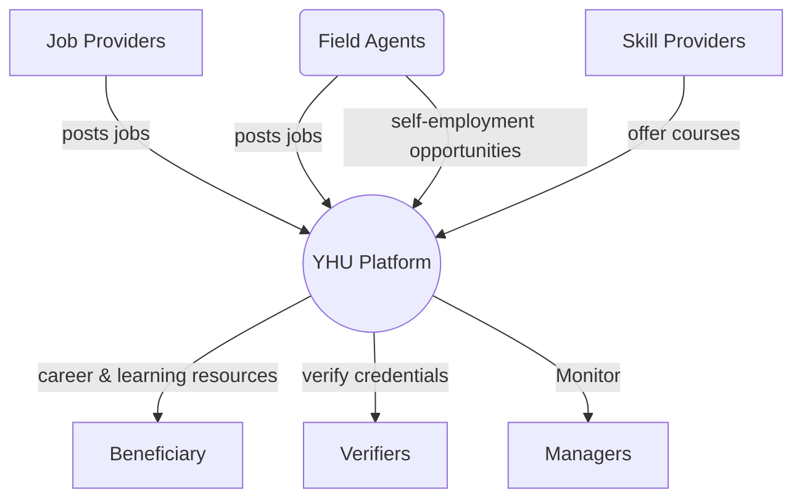


# Business Requirement Specs YH 2.0.1

### Scope

to record the business requirements of the integrated youth hub platform.

### Modules being integrated

- youth-hub
- pathways
- partner-app

>  **P2E is not part of the integration** and will be treated as an external skills platform that is integrated with YH

## Audience

- all business stake holders
- product team
- development vendors (later)

## Purposes

1. **Business users**:
    - to confirm user stories
    - to confirm data structures
    - to confirm actions and business rules

2. **Product team**:
    - to help design site map
    - to build wireframes

3. **Dev team**:
    - to help build mock.
    - as input for design specs

# Context Diagram

==The entity names above will be changed after confirmation of glossary and terms==

## Dig Deep

1. [Pathways](pathways.md)
2. [Data Structures](structures.md)
3. [Enums](enums.md)
4. [Glossary](glossary.md)

