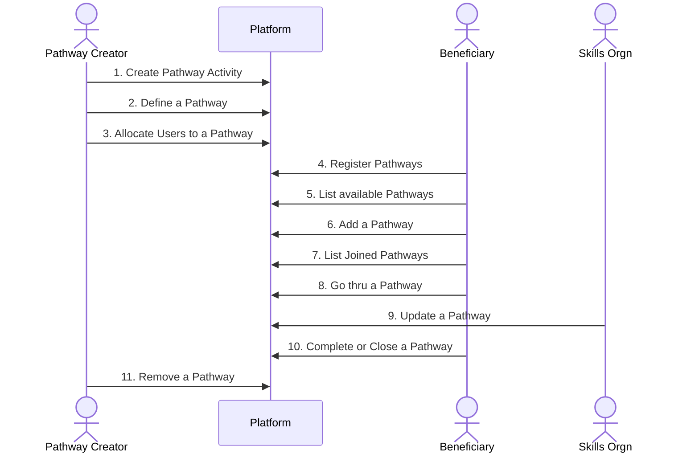

# Pathways

## Terms

### **Pathway Activity**: 
These are individual activities that a Beneficiary can do. 

The different types of activities are:

- `earning`, 
- `skilling`, 
- `forms`, 
- `artefacts`. 
 
A pathway activity can belong to one or more Pathways. 

### **Pathway**: 
This is a list of activities that define a pathway.

### **Pathway Creator**
The role that will be allowed to do the steps as outlined below.

### **Pathway Activity Types**

#### **_Earning Activity_**
These are a specific earning opportunity link or a link that lists a number of earning opportunities.

#### **_Skills Activity_**
This is a specific skills opportunity link from a Skills partner Organisation (incl P2E)

#### **_Forms Activity_**
This is a link to a Form

!!! question "How does this link be available?"

#### **_Artefact Activity_**
This is a link to a video or pdf or similar content

---

## Pathway Creation

## Step 1: Pathway Activity Creation

[Check the Pathway Activity Data Structure](structures.md/#pathway-activity)

!!! question "Rules/Features missing"

## Step 2: Pathway Definition

[Check the Pathway Data Structure](structures.md/#pathway)

**Rules/Features**

- Search Pathway Activities (criteria?)
- Copy existing Pathway as a template to add/subtract activities
- Publishing makes the Pathway available for next step
- If a user is undergoing a Pathway it cannot be edited.
- A Published Pathway can be marked as deleted (even if a user is undergoing)
- A deleted Pathway is no longer available to a Beneficiary.

!!! question "Need clarification on"
    - Criteria for search of Pathway Activities 
    - Activity Type Links

## Step 3: Allocate Users to Pathway

[Check Pathway Beneficiary Search Form¶](structures.md/#pathway-beneficiary-search-form)

**Rules/Features**

!!! question "None defined so far"

## Step 4: Beneficiary Registration

**Rules/Features**

1. Beneficiary will need to register once when some fields will be mandatory to proceeed.
2. [Check min-set fields required for Pathways registration](structures.md/#pathways-registration-form)

## Step 5: List Available Pathways

[Check the fields of the view](structures.md/#pathways-available-view)

**Rules/Features**

1. Only Pathways allocated to the Beneficiary is listed here.

!!! question "Should this list be filterable/ sortable?"

## Step 6: Add a Pathway

**Rules/Features**

1. From the Step 5 list of available pathways, on selection, the Pathway activities are visible. [Check Pathway Details View structure](structures.md/#pathway-details-view)

2. On confirmation, the pathway is added to the Beneficiary Joined Pathways List.

## Step 7: List Joined Pathways

[Check View Structure](structures.md/#pathways-joined-view)

**Rules/Features**

1. A pathway can be selected and a priority set ([Check Priority enums](enums.md/#pathway-priority))
2. Pathways on the list are sorted on priority.
3. On selection of a Pathway, that row becomes the top-most row. (_Does this mean that it becomes priority A?_)
4. Closed Pathways are at the bottom
 
## Step 8: Go through a Pathway

**Rules/Features**

1. The first time the Beneficiary opens an added Pathway, the system should confirm and record start of the pathway.
2. [Check the Pathway Joined Detailed View](structures.md/#pathway-joined-detailed-view)
3. No more than 3 pathways can be "current" at any time.
4. In the above view, the user can pick the current activity (if in progress) or the next availability depending on the is_order boolean.
5. The following are the rules on completion:
    1. `earning` type: clicking on link will make it as "done".
    2. `skills-w-feedback` type: click on link will make status as "in progress". This will auto update when skills organisation updates data
    3. `skills-w/o-feedback` type: click on link will make status as "in progress". Beneficiary will manually update when activity is completed.
    4. `artefacts` type: when user clicks on link, the activity status is marked as "done"
    5. `forms` type: when user clicks on link, the activity status is marked as "done"  

!!! question "Shareable activity across Pathways needs to be discussed"

## Step 9: Update of a Pathway

**Rules/Features**

1. When Beneficiary clicks on a Skills link that is from an Organisation that provides the platform feedback, this step updates the completion status of the activity.

!!! question "Would anyone else be updating Activity Status?"

## Step 10: Complete or Close a Pathway

**Rules/Features**

1. If all activities are done, the Pathway will automatically get closed.
2. The Beneficiary can close any Pathway at any time.

!!! question "Can a closed Pathway be re-opened?"