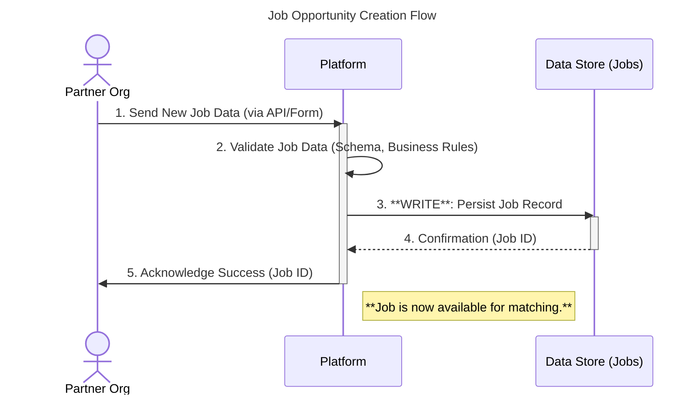
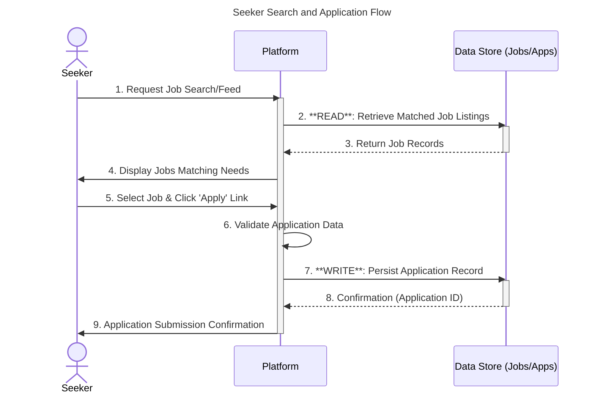
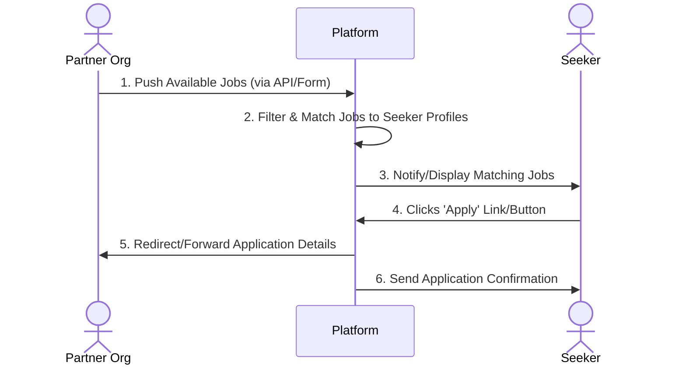
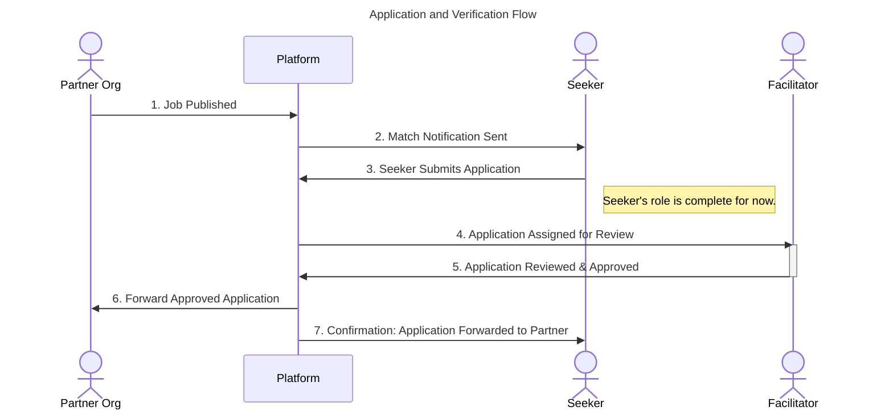

### 💼 User Story: Partner Job Posting

*As a* **Partner Organisation**, *I want* to easily publish job opportunities, *so that* beneficiaries can apply directly, streamlining the hiring process.

